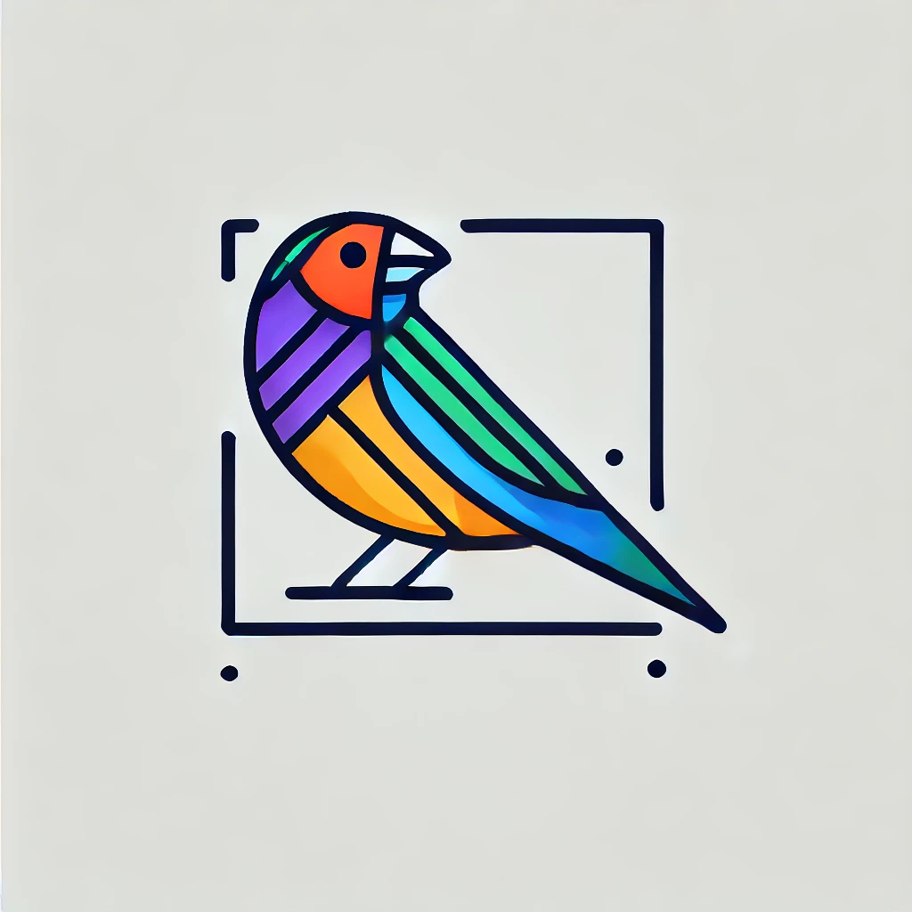

# Finchly
## Helper utilities for integration testing

[](https://github.com/kpavlov/finchly/actions/workflows/maven.yml)
[](https://app.codacy.com/gh/kpavlov/finchly/dashboard?utm_source=gh&utm_medium=referral&utm_content=&utm_campaign=Badge_grade)
[](https://app.codacy.com/gh/kpavlov/finchly/dashboard?utm_source=gh&utm_medium=referral&utm_content=&utm_campaign=Badge_coverage)



## How to build

Building project locally:
```shell
mvn clean verify
```
or
```shell
make build
```

